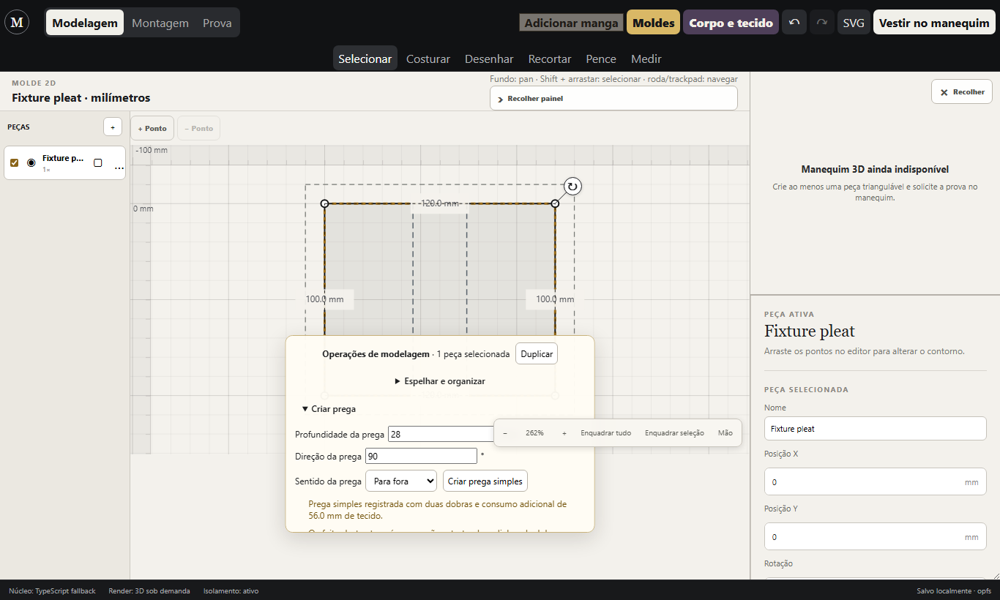
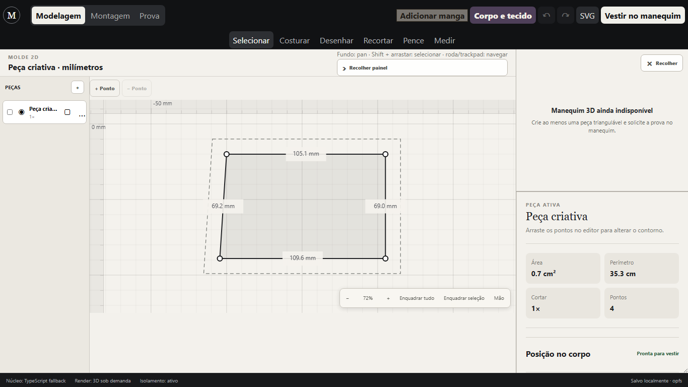
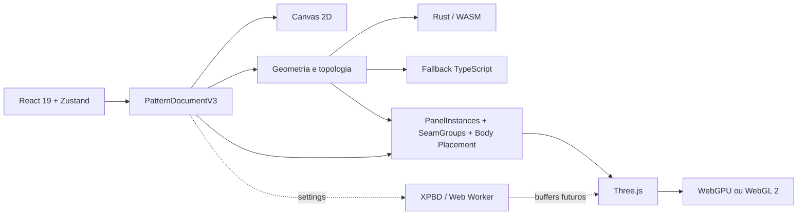
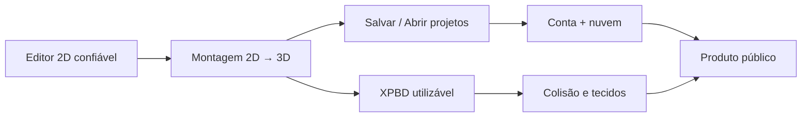

<div align="center">

# Moldeon

**Modelagem técnica 2D de roupas e montagem 3D no navegador.**

Um editor open source para transformar moldes em dados estruturados, editar geometria com precisão e preparar peças para montagem e simulação 3D sem deixar o renderer virar a fonte da verdade.

[](#estado-atual)
[](LICENSE)
[](package.json)
[](apps/web/package.json)
[](apps/web/package.json)
[](crates/pattern-core)

</div>

> [!IMPORTANT]
> O Moldeon está em desenvolvimento ativo. O editor 2D já é funcional e a montagem 3D está sendo estabilizada, mas o projeto **ainda não deve ser tratado como software industrial de modelagem nem como simulador físico de tecido validado**.

<p align="center">
  
  
</p>

## O que é o Moldeon?

O Moldeon nasce da ideia de aproximar duas etapas que normalmente vivem separadas:

1. **construir e editar o molde técnico em 2D**;
2. **usar exatamente essa geometria para montar a peça no espaço 3D**.

A regra central do projeto é simples: **o molde 2D é a fonte da verdade**. Three.js, o avatar e a futura simulação física são consumidores dessa geometria, não sistemas paralelos que podem inventar outra peça.

O objetivo de longo prazo é permitir um fluxo como:

```text
Criar molde
   ↓
Editar pontos, curvas e operações
   ↓
Definir tecido, quantidade de corte e semântica
   ↓
Costurar peças
   ↓
Definir onde cada painel pertence no corpo
   ↓
Montar no 3D
   ↓
Simular tecido
   ↓
Salvar, compartilhar e continuar em outro dispositivo
```

## Estado atual

Legenda: ✅ funcional no fluxo atual · 🧪 experimental · 🧱 infraestrutura pronta/parcial · ⏸ adiado deliberadamente · 📋 planejado

| Área | Estado | Observação |
|---|---:|---|
| Editor 2D em milímetros | ✅ | Canvas, zoom, pan, seleção e edição direta |
| Múltiplas peças na bancada | ✅ | Seleção, mover, girar, duplicar, espelhar e excluir |
| Curvas Bézier | ✅ | Segmentos cúbicos e alças editáveis |
| Caminhos internos | ✅ | Referência, dobra, marcação, corte, corte com costura e pence |
| Corte topológico | ✅ | Preserva geometria e rejeita casos estruturalmente ambíguos |
| Pence estrutural | ✅ | Pernas, ápice e fechamento persistentes |
| Costuras e `SeamGroupV3` | ✅ | Intervalos de borda, tratamento, distribuição, proporção e folga |
| Undo/redo transacional | ✅ | Um comando por gesto e restauração de estado |
| Autosave local | ✅ | OPFS quando disponível, com fallback legado |
| Formato `.moldeon` | 🧱 | Serializer/importador V3 existe; a integração completa de Abrir/Salvar na UI ainda está sendo finalizada |
| Classificação corporal explícita | ✅ | Peças começam sem classificação e o usuário confirma função, região, superfície, lado e anchor |
| Pipeline 2D → 3D | ✅ | A malha deriva da geometria corrente e é reconciliada por instância |
| Montagem 3D estática | 🧪 | Preparação e posicionamento, não caimento físico |
| Avatar humano GLB/glTF | 🧱 | Loader e contrato de calibração existem; nenhum asset humano é publicado sem aprovação explícita |
| XPBD | 🧪 | Núcleo de constraints e Worker de demonstração existem, ainda sem alimentar a roupa do viewport |
| Moldes automáticos prontos | ⏸ | Geradores permanecem internos até validação real de modelagem/toile |
| Conta e projetos na nuvem | 📋 | Planejado para a camada de produto |
| Assinaturas/pagamentos | 📋 | Fora do núcleo atual |

### Uma decisão importante sobre os moldes prontos

O repositório contém geradores paramétricos, fórmulas, landmarks, conectores, lógica de manga e pesquisas de moldes-base. Eles **não são expostos publicamente neste momento**.

Testes computacionais conseguem provar integridade geométrica, mas não conseguem provar sozinhos que um molde é correto, vestível ou adequado para produção. Por isso, templates automáticos só devem voltar ao produto após método rastreável, revisão manual e, quando necessário, toile/prova física.

## O que você consegue fazer hoje

No fluxo atual é possível:

- começar em uma bancada vazia e desenhar peças próprias;
- trabalhar em milímetros;
- editar pontos, nós, segmentos retos e curvas cúbicas;
- manipular várias peças na bancada;
- duplicar e espelhar peças;
- desenhar caminhos internos persistentes;
- cortar peças por caminhos retos ou curvos;
- criar pences estruturais sem limites estéticos arbitrários;
- selecionar bordas e criar relações de costura;
- configurar tecido, quantidade de corte e espelhamento;
- classificar explicitamente uma peça para torso, cintura, quadril, braço, perna ou pescoço;
- gerar instâncias físicas a partir de uma definição de molde;
- preparar a montagem 3D a partir da geometria atual;
- alterar o 2D e atualizar a mesma peça correspondente no 3D;
- usar autosave local durante a edição;
- exportar SVG técnico em escala.

## Princípios de produto e engenharia

Algumas regras são tratadas como invariantes do Moldeon:

### 1. O 2D manda

`PatternDefinitionV3` possui a geometria técnica autoritativa. O 3D nunca deve substituir, reinterpretar silenciosamente ou criar uma segunda versão da peça.

### 2. Milímetros são canônicos

A geometria de molde é persistida em `mm`. Conversões para metros acontecem somente nas fronteiras que realmente precisam delas, como renderização e física.

### 3. Instância não é geometria duplicada

Uma definição pode gerar várias cópias físicas:

```text
1 definição de manga
        ↓
PanelInstance esquerda
PanelInstance direita
```

`PanelInstanceV3` referencia a definição. Ele não possui uma cópia independente da geometria.

### 4. Semântica explícita vence heurística silenciosa

Nome de peça, posição na bancada e `templateId` não devem decidir onde uma peça pertence no corpo.

Uma peça chamada `Costas` continua sem classificação até que a intenção seja conhecida ou confirmada.

### 5. O software bloqueia impossibilidades, não criatividade

As operações não devem impor largura, tamanho, formato ou ordem de clique arbitrários. Elas devem rejeitar somente estados estruturalmente impossíveis, ambíguos ou que corromperiam o documento.

### 6. Física precisa ser física

Montagem geométrica não é vendida como simulação. Gravidade, colisão, cisalhamento, flexão e autocolisão só serão apresentados como comportamento físico quando estiverem realmente implementados e testados.

## Arquitetura



### `PatternDocumentV3`

É o contrato persistido central do projeto.

```text
PatternDocumentV3
├── metadata
├── measurements
├── variables
├── constructionGraph
├── patternDefinitions
│   └── geometria 2D autoritativa
├── panelInstances
│   └── cópias físicas derivadas
├── seamGroups
├── fabrics
├── body
├── workspace
├── garmentSettings
└── simulationSettings
```

Não pertencem ao documento canônico:

- câmera;
- objetos do Three.js;
- buffers temporários da GPU;
- posições de partículas simuladas;
- velocidades;
- multiplicadores do solver;
- estado transitório de componentes React.

Isso deixa o arquivo de projeto portátil e reduz o risco de o estado visual contaminar o molde técnico.

## Stack

| Camada | Tecnologia |
|---|---|
| Interface | React 19 |
| Estado | Zustand 5 |
| Linguagem principal | TypeScript 6 |
| Build/dev server | Vite 8 |
| Testes web | Vitest 4 |
| Editor 2D | Canvas 2D |
| 3D | Three.js 0.185 |
| Render | WebGPU quando disponível, WebGL 2 como fallback |
| Geometria nativa | Rust 2021 + `wasm-bindgen` |
| Física em desenvolvimento | XPBD + Web Worker |
| Persistência local | OPFS / armazenamento do navegador |
| Backend futuro | Laravel + Sanctum + PostgreSQL |
| Infra opcional | PostgreSQL, Redis e MinIO via Docker |

## Estrutura do repositório

```text
Moldeon/
├── apps/
│   └── web/
│       └── src/
│           ├── avatar/        modelo paramétrico, colisão e assets aprovados
│           ├── components/    interface React
│           ├── core/          fronteiras do engine
│           ├── domain/        modelo, validações e operações puras
│           ├── editor/        Canvas, câmera 2D e interações
│           ├── export/        exportadores como SVG
│           ├── garment3d/     topologia, montagem e bridge para o 3D
│           ├── patterns/      geradores paramétricos internos
│           ├── physics/       núcleo XPBD experimental
│           ├── state/         stores Zustand e histórico
│           ├── storage/       autosave, migrações e `.moldeon`
│           ├── viewport/      Three.js, renderer e lifecycle
│           └── workers/       trabalho fora da thread principal
├── crates/
│   └── pattern-core/          núcleo geométrico Rust/WASM
├── docs/                      arquitetura, domínio, roadmap e estudos
├── infrastructure/            configuração de deploy
├── scripts/                   build, auditorias e utilitários
├── templates/
│   └── laravel/               scaffold do backend futuro
└── docker-compose.yml         PostgreSQL, Redis e MinIO para desenvolvimento
```

## Começando rápido

### Requisitos mínimos para trabalhar no frontend

- Git;
- Node.js **22.12.0 ou superior**;
- npm;
- Chrome, Edge ou outro navegador moderno.

### Rodar sem Rust/WASM

É o caminho mais rápido para começar a contribuir na interface, domínio TypeScript e editor:

```bash
git clone https://github.com/GabrielVioli/Moldeon.git
cd Moldeon
npm install
npm run dev:fallback
```

O Vite mostrará a URL local, normalmente `http://localhost:5173`.

### Rodar com Rust/WASM

Além do Node, instale Rust pelo `rustup`, o target WebAssembly e `wasm-pack`:

```bash
rustup target add wasm32-unknown-unknown
cargo install wasm-pack --version 0.13.1
npm install
npm run dev
```

### Comandos úteis

```bash
npm run dev             # build WASM de desenvolvimento + Vite
npm run dev:fallback    # Vite usando o fallback TypeScript
npm run build           # typecheck + build web fallback
npm run build:wasm      # build Rust/WASM + frontend
npm run wasm:build      # somente WASM release
npm run typecheck       # TypeScript
npm run test            # Vitest
npm run check           # typecheck + testes web
```

Rust:

```bash
cargo fmt --all --check
cargo clippy --workspace --all-targets -- -D warnings
cargo test --workspace
```

## Qual caminho do código devo ler primeiro?

Se você acabou de chegar ao projeto, esta ordem reduz bastante a curva de aprendizado:

1. [`docs/ARCHITECTURE.md`](docs/ARCHITECTURE.md) para entender as fronteiras;
2. [`docs/PATTERN_DOCUMENT_V3.md`](docs/PATTERN_DOCUMENT_V3.md) para entender o formato canônico;
3. `apps/web/src/domain/patternDocumentV3.types.ts` para os tipos reais;
4. `apps/web/src/state/editorStore.ts` para os comandos do editor;
5. `apps/web/src/editor/PatternCanvas.tsx` para a interação 2D;
6. `apps/web/src/domain/internalPaths.ts` e `patternOperations.ts` para operações geométricas;
7. `apps/web/src/garment3d/ResolvedAssemblyInput.ts` para a fronteira V3 → montagem;
8. `apps/web/src/garment3d/PanelTopology.ts` e `GarmentAssembly.ts` para a malha;
9. `apps/web/src/viewport/GlobalThreeViewport.ts` para o renderer e lifecycle;
10. `crates/pattern-core/src/lib.rs` para o núcleo Rust atual.

## Testes e qualidade

Pull requests passam pelo menos por:

```text
TypeScript typecheck
        +
Vitest
        +
Build web fallback
        +
Rust fmt
        +
Clippy -D warnings
        +
Cargo test
```

Para alterações geométricas, um teste unitário não substitui verificação visual. Sempre que a mudança atingir o editor, montagem ou viewport, valide também a jornada real no navegador.

Para features que ligam 2D e 3D, um teste de regressão especialmente importante é:

```text
criar peça
→ classificar
→ montar em 3D
→ mover um ponto/handle no 2D
→ verificar a mesma instância atualizada no 3D
→ apagar a peça
→ confirmar que a mesh desapareceu
```

## Como contribuir

Contribuições são bem-vindas. O projeto ainda muda rápido, então mudanças pequenas e verificáveis são preferíveis a grandes refactors misturados com features.

Antes de abrir um PR grande:

1. leia a arquitetura e o contrato V3;
2. confirme qual camada deve ser dona da mudança;
3. evite criar um segundo formato de projeto ou um estado paralelo de geometria;
4. mantenha IDs e referências topológicas estáveis quando possível;
5. não infira intenção por nome de peça, índice, template ou posição visual;
6. faça operações destrutivas de forma atômica e compatível com undo/redo;
7. adicione testes para o comportamento que está sendo alterado;
8. rode `npm run check` e os checks Rust aplicáveis;
9. descreva limitações reais no PR, sem promover protótipos a recursos concluídos.

### Áreas especialmente úteis para contribuição

- persistência e UX de projetos `.moldeon`;
- acessibilidade e navegação por teclado;
- experiência mobile/tablet do editor;
- ferramentas de modelagem 2D;
- preservação topológica durante operações;
- testes de round-trip do `PatternDocumentV3`;
- integração e calibração de avatar GLB/glTF licenciado;
- lifecycle e performance do Three.js;
- XPBD, colisão e constraints de costura;
- documentação técnica e fixtures reproduzíveis.

### O que exige cuidado extra

**Templates paramétricos:** não publique um molde automático como “validado” só porque compila, triangula ou passa testes geométricos. A contribuição precisa separar pesquisa interna de recurso aprovado para usuários.

**Física:** não use deformações visuais ou interpolação geométrica para simular um recurso físico inexistente. Se não há gravidade/colisão/constraint real, trate como montagem ou preview.

**Migrações:** um arquivo inválido não pode destruir o projeto atualmente aberto. Parsing e migração devem concluir antes da troca atômica de estado.

## Arquivos `.moldeon`

O formato portátil já possui MIME e extensão próprios:

```text
meu-projeto.moldeon
```

Internamente, a versão atual é um `PatternDocumentV3` validado e serializado em JSON. Isso facilita debug, migração e interoperabilidade entre web, backend e um possível aplicativo desktop no futuro.

O formato preserva a estrutura editável do projeto, não apenas uma imagem do molde.

## Avatar 3D

O código separa três conceitos que não devem ser confundidos:

```text
AvatarParametricModel
    medidas, landmarks e anchors

AvatarCollisionModel
    proxies para colisão física futura

ApprovedAvatarAsset
    visual humano GLB/glTF aprovado
```

O registro de assets humanos visíveis é deliberadamente vazio até existir um modelo com licença, autoria e calibração aprovadas. Colocar um arquivo em `public/` não o torna automaticamente parte do produto.

## Física

Já existe um núcleo XPBD isolado e uma demonstração em Web Worker para constraints de distância. Ele é infraestrutura, não o solver final de roupa.

Ainda faltam, entre outros:

- integração temporal completa;
- gravidade aplicada à malha da roupa;
- stretch warp/weft;
- shear;
- bend;
- conversão completa de `SeamGroupV3` em constraints;
- colisão com o avatar;
- autocolisão;
- atrito e espessura.

## Backend e nuvem

O frontend funciona sem backend. O repositório contém infraestrutura e um scaffold opcional para a futura API Laravel.

Para criar a base local:

```powershell
.\scripts\create-api.ps1
```

O script gera `apps/api`, instala a API/Sanctum e copia os arquivos-base de projeto presentes em `templates/laravel`.

Os serviços auxiliares podem ser iniciados com:

```bash
docker compose up -d
```

Isso sobe PostgreSQL, Redis e MinIO para desenvolvimento. **Conta, sincronização em nuvem e cobrança ainda não fazem parte do fluxo público atual.**

## Roadmap resumido



Prioridades imediatas do produto:

1. fechar e validar o pipeline canônico 2D → 3D;
2. tornar `.moldeon`, abrir, salvar e recovery parte da UX pública;
3. adicionar conta e projetos persistentes na nuvem;
4. integrar um solver XPBD mínimo e verificável;
5. estabilizar UX, mobile, acessibilidade e performance para beta pública.

O roadmap técnico detalhado está em [`docs/ROADMAP.md`](docs/ROADMAP.md).

## Documentação

| Documento | Conteúdo |
|---|---|
| [`ARCHITECTURE.md`](docs/ARCHITECTURE.md) | fronteiras e responsabilidades |
| [`PATTERN_DOCUMENT_V3.md`](docs/PATTERN_DOCUMENT_V3.md) | contrato do documento canônico |
| [`DOMAIN_STUDY.md`](docs/DOMAIN_STUDY.md) | estudo de modelagem e costura |
| [`ROADMAP.md`](docs/ROADMAP.md) | evolução planejada |
| [`PHYSICS_PLAN.md`](docs/PHYSICS_PLAN.md) | direção para a física |
| [`SLEEVE_SYSTEM.md`](docs/SLEEVE_SYSTEM.md) | sistema guiado de manga |
| [`PATTERN_LIBRARY.md`](docs/PATTERN_LIBRARY.md) | infraestrutura interna de templates |
| [`INSTALL_WINDOWS.md`](docs/INSTALL_WINDOWS.md) | setup detalhado no Windows |
| [`MOLDEON_MASTER_PLAN.md`](docs/MOLDEON_MASTER_PLAN.md) | visão técnica de longo prazo |

> [!NOTE]
> Alguns documentos históricos descrevem estágios anteriores da recuperação. Em caso de conflito, o código atual e `PatternDocumentV3` são a referência técnica; documentos de progresso registram decisões tomadas em cada gate.

## Limitações conhecidas

- não há simulação física de tecido conectada ao viewport;
- o manequim humano visual ainda depende de um asset GLB/glTF aprovado;
- templates automáticos estão ocultos e adiados para validação real;
- a UX pública de abrir/salvar `.moldeon` ainda está em integração;
- conta, nuvem e colaboração ainda não estão disponíveis;
- operações booleanas universais de contorno ainda não existem;
- cortes ambíguos, tangências e regiões degeneradas são rejeitados em vez de tentar adivinhar intenção;
- o núcleo Rust ainda trabalha com `PatternPiece` em algumas fronteiras enquanto o documento raiz V3 permanece autoritativo no TypeScript;
- mobile funciona, mas continua sendo uma área ativa de refinamento de espaço e interação.

## Licença

Moldeon é distribuído sob a licença [MIT](LICENSE).

Você pode usar, estudar, modificar e distribuir o código respeitando os termos da licença e as licenças individuais de assets externos que venham a ser adicionados no futuro.

---

<div align="center">

**Moldeon é um projeto em construção.** Se você trabalha com modelagem, costura, geometria computacional, gráficos 3D ou simulação física, há espaço para contribuir.

</div>
